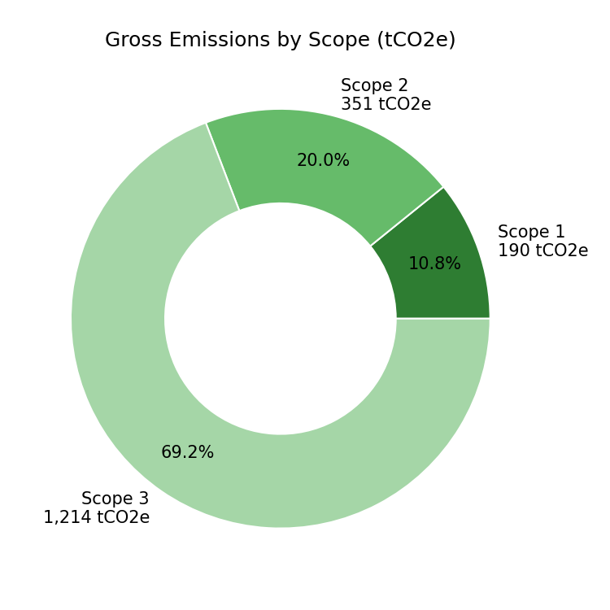

# GHG Emissions Python Pipeline

A Python/pandas re-implementation of the calculation engine behind my Excel-based [Corporate GHG Emissions Inventory Model](https://github.com/rachnasingh1012/Corporate-GHG-Inventory-model): a GHG Protocol Scope 1–3 emissions pipeline that takes raw activity data and emission factors in, and produces a reconciled emissions summary and charts out.

**Author:** Rachna Singh



## What this is

The Excel model proves the GHG Protocol accounting method with live spreadsheet formulas. This project proves the same method as reusable, testable code: a `pandas` pipeline that loads activity data from CSV, applies `activity data × emission factor ÷ 1,000` per GHG Protocol Corporate Standard convention, and rolls the results up by scope and category — in a form that can be re-run against a new activity data file, a new reporting year, or a different organization in seconds, instead of rebuilding formulas by hand.

It is built to be checked, not just trusted: a `pytest` suite reconciles every pipeline output against the independently-built Excel model's published results, so the two implementations of the same method are proven to agree line-by-line.

## How it works

```
data/activity_data.csv  →  ghg_pipeline.py  →  outputs/
  (17 emission sources,        (load → calculate →         emissions_detail.csv
   Scope 1/2/3, GHG              summarise by scope/         emissions_by_scope.csv
   Protocol categories)          category → chart)           emissions_by_category.csv
                                                               scope_breakdown.png
                                                               category_breakdown.png
```

Run it:

```bash
pip install -r requirements.txt
python ghg_pipeline.py --input data/activity_data.csv --outdir outputs
```

Run the reconciliation tests:

```bash
pytest tests/ -v
```

## Key results (reconciled to the Excel model)

| Metric | Python pipeline | Excel model | Match |
|---|---|---|---|
| Total gross emissions | 1,755.0 tCO₂e | 1,755.0 tCO₂e | ✓ |
| Scope 1 | 189.9 tCO₂e (10.8%) | 189.9 tCO₂e (10.8%) | ✓ |
| Scope 2 | 350.7 tCO₂e (20.0%) | 350.7 tCO₂e (20.0%) | ✓ |
| Scope 3 | 1,214.5 tCO₂e (69.2%) | 1,214.5 tCO₂e (69.2%) | ✓ |
| Intensity | 8.78 tCO₂e / FTE | 8.8 tCO₂e / FTE | ✓ |

All 9 automated tests pass — see [`tests/test_pipeline.py`](tests/test_pipeline.py).

## Project structure

- **`ghg_pipeline.py`** — the pipeline: `load_activity_data()`, `calculate_emissions()`, `summarise_by_scope()`, `summarise_by_category()`, `add_intensity()`, plus chart generation and a CLI entry point (`argparse`).
- **`data/activity_data.csv`** — the 17 emission sources (Scope 1 stationary/mobile/fugitive, Scope 2 electricity/heat, Scope 3 categories 1–8), each with its activity data, unit, emission factor, and factor source — the same inputs as the Excel model's Calculations sheet.
- **`tests/test_pipeline.py`** — `pytest` unit tests: a single-line calculation check, and reconciliation tests for Scope 1, Scope 2, Scope 3, total emissions, intensity, and category coverage against the Excel model's published figures.
- **`outputs/`** — generated on each run: detail and summary CSVs, plus a scope-breakdown donut chart and a Scope 3 category bar chart (`matplotlib`).

## Why I built this

My existing carbon-accounting projects are Excel-based, which is where I first learned and proved out the GHG Protocol methodology. This project takes the same, already-validated method and expresses it in pandas — data loading, vectorised calculation, groupby aggregation, automated testing, and charting — as a first step in building out coded (not just spreadsheet) data-analysis skills for ESG/sustainability data work.

## Skills demonstrated

Python · pandas (vectorised calculation, `groupby` aggregation) · pytest (unit testing, reconciliation testing against an independent source of truth) · matplotlib (chart generation) · GHG Protocol Scope 1–3 methodology · reproducible, re-runnable data pipelines vs. one-off spreadsheet calculation.
